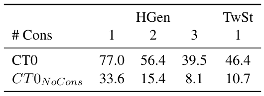

*This was a paper I presented about in Bang Liu's research group meeting on 2022-06-06. You can view the slides I used [here](https://docs.google.com/presentation/d/1-L5TnQvh-4WQHRSlIU-gcCyzudFxzZC0ur7vtLS28gs/edit?usp=sharing).*

Continual-T0 (CT0) extends [T0]() by progressively training it on 8 unseen language generation tasks, while retaining a replay buffer of 1% of the original training data to preserve performance. The result is a model that maintains nearly all of its performance on previous tasks while learning the new tasks. In addition, CT0 maintains the original T0's performance on unseen tasks (which is a big deal because those tasks could not appear in the replay buffer) and it extends the compositionality of T0 to even more unseen tasks.

## the new tasks

Only one of T0's training tasks was a language generation task, and none of the evaluation tasks were. For Continual-T0, the new tasks are all language generation tasks.{}When using general-purpose language models for downstream language tasks, the distinction between language understanding (NLU) and generation (NLG) tasks comes down to decoding: for NLU tasks, the classification is done by comparing the model's likelihood estimate for the keywords associated with each class. This distinction makes it notable that T0 can maintain performance on both types of tasks.{}



## experiments

They started with the 3 billion-parameter version of T0, using the same hyperparameters from the T0 paper. For each task, they used 100,000 samples for training; tasks with less data were upsampled. They experimented with rehearsal rates of 0%, 0.25%, and 1%. They report different metrics appropriate for each task: ROUGE for summarization, BLEU and SARI for simplification, and BERTScore for more open-ended tasks like dialogue or explanation generation, plus custom metrics in certain cases:

- *constraint accuracy*: for prompts like "Write a text that *starts/contains/ends* with [something]", report how often the constraint is respected
- *first word distribution*: report the inverse of the divergence between the distribution of first words in the ground truth examples and that of generated samples
- *tweet author classification*: train a simple ridge classifier on ground truth tweets to predict author, and then report the accuracy of that model on the generated tweets
- *haiku acceptability*: how far off the generated haiku is from the 3-line and 17-syllable requirements

### experiments with a single new task

These experiments start with the pretrained T0 and train on one of the new tasks, recording both the performance on the new task as well as the performance on the old zero-shot T0 tasks. Doing this while rehearsing the T0 training data at rates of 0%, 0.25%, and 1% gave the following results for each of three tasks:

  

These results are plotted as relative gain, where 0 is the performance of the pretrained T0 model and 1.0 is the maximum performance achieved when fine-tuned only on that task. The blue lines are the relative gain for the task being trained on, and the green lines are the scores for the original T0 zero-shot tasks.

It's clear that in this experiment the model catastrophically forgets the T0 zero-shot tasks when rehearsal is not used, but retains them when rehearsal is used.

### experiments with 8 new tasks

The main experiment started from T0-11B (pretrained on 50 datasets) and progressively trained on the 8 new NLG tasks with a rehearsal rate of 1%. They find that performance is preserved for the original T0 zero-shot tasks, as well as for each of the new tasks:



The authors report that no task suffers a decrease in performance more than 2%.

## Why is CT0 successful?

The authors performed the same experiment with T5, and again with a randomly initialized T5. They found that CT5 performs similarly to CT0, while the flat-start model performed poorly even when trained only on the target task. This implies that the continual learning capability comes from pretraining, and not from the instruction tuning paradigm or the size.

## scaling

They note that the 3 billion parameter model exhibited more forgetting than the 11B model.

## zero-shot task composition

The headline generation task seen by CT0 included a single constraint, meaning the prompt was something like "Make a title for this article containing X." They found that the model was able to generalize to multiple constraints, with prompts of the form "Make a title for this article containing X and Y." They even found they could apply it to the tweet stylometry task, with the prompt "Write a tweet about X, in the style of Y, containing Z." Below is a table containing the accuracy with which the model obeyed the constraints, along with its accuracy when the constraints aren't included in the prompt:

It's clear that the model is able to follow these unseen kinds of instructions much more often than random chance.

The model was also able to apply a requested emotion to its generated haikus, according to a binary sentiment analysis classifier:

