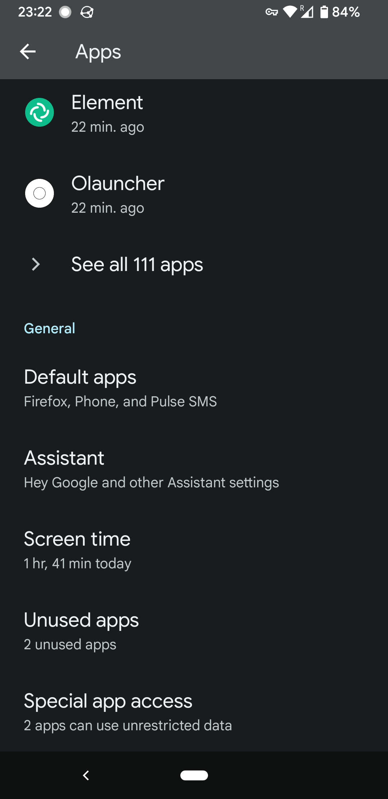
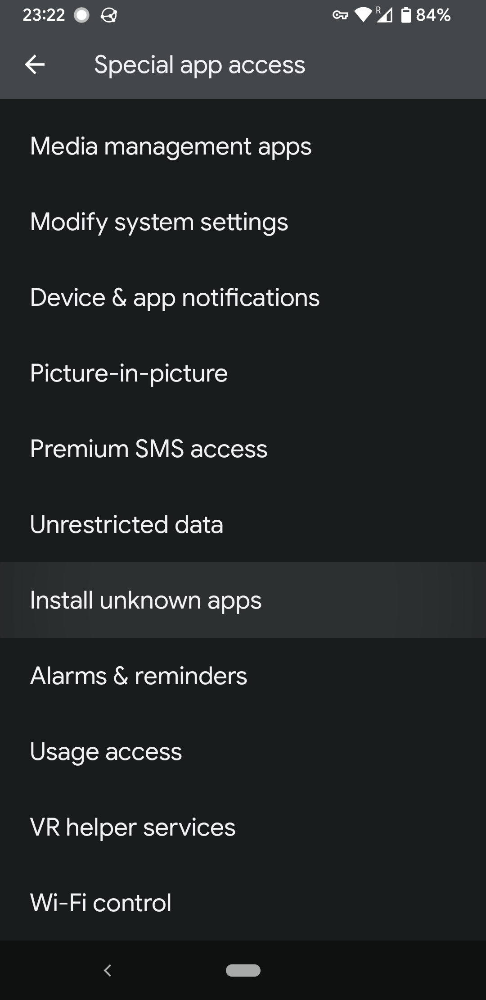

**Update 2022-04-27**: The beta is over, but the apk is still installable with the instructions below and any feedback sent from inside the app will be received by me. I'm going to be working on this more over the summer, and eventually publishing it on the app store. :)

Ever since learning Spanish, it has been a dream of mine to create a vocabulary study app that meets my needs. Duolingo won't cover advanced vocabulary, Anki requires manually-generated decks, and other apps have expensive subscription plans.

For a group project in my [NLP class](http://www-labs.iro.umontreal.ca/~liubang/IFT%206289%20-%20Winter%202022.htm) this semester I finally got started on this project. We've written the basic functionality of the app for learning French from English. Beta testing starts now!

## downloading the beta testing app

You can download the app [here](beta.apk). In order to install the app from this file, you need to go to Android settings, click "Apps", then "Special app access", then "Install unknown apps", and then allow your phone's browser to install apps. Here's how I do it for Firefox on my phone:

  

Once you've changed that setting, click the link above to download and install the app.

## using the app

The app uses [spaced repetition](https://en.wikipedia.org/wiki/Spaced_repetition) to choose which cards to show you each day. For this beta program, the app will show you ten new cards every day plus the cards you need to review. So on the first day you'll see 10 cards, on the second day you'l see \~20 cards, on the third day you'll see \~25 cards (depending on how many you missed the day before), etc. You should be able to move through the cards quickly and only spend a few minutes studying each day.

The app starts by showing you the most common words in the French language. When a new card appears, you have the option to skip the word if it's a word you already know. This means the card is dropped from the spaced repetition algorithm and you won't see it again. This is useful if you already have some experience with French and don't want to waste time seeing words you're familiar with. If you're advanced in French, you may need to spend a lot of time skipping words on the first day until the app can find ten words that are new to you.

We want you to use the app **every day for one week**, to find out how well people learn from the example sentences provided by the app. After going through the cards each day, the app will ask you a few questions and then ask you to upload your responses by clicking a button. It's very important that you upload your responses, because that's how we'll receive your feedback.

When the week is over (2022-04-26), you're free to keep using the app as long as you like!
